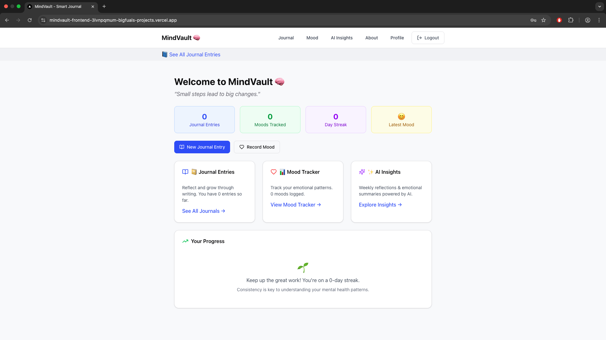
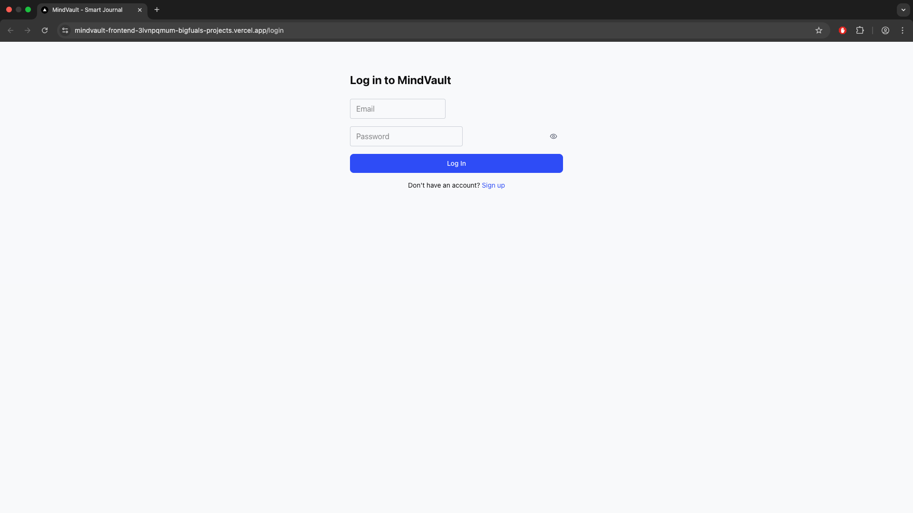
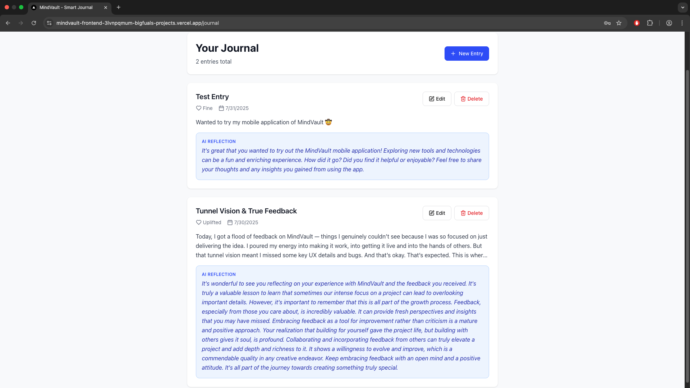
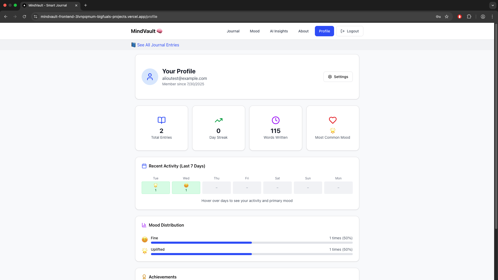

# 🧠 MindVault

MindVault is a full-stack journaling platform that uses AI to analyze emotional patterns and provide personalized insights. Built with FastAPI, PostgreSQL, and Next.js, it’s designed for developers, mental health enthusiasts, and productivity hackers.

---

## 🚀 Live Demo

🔗 [mindvault-frontend.vercel.app](https://mindvault-frontend-3lvnpqmum-bigfuals-projects.vercel.app)

---

## 📸 Screenshots

### 🏠 Dashboard


### 🔐 Login


### 📓 Journal Page


### 👤 Profile Page


---

## 🧩 Features

- 📔 **Journaling** – Add and manage private journal entries
- 📈 **Mood Tracker** – Visualize mood trends over time
- 🧠 **AI Insights** – OpenAI integration for reflective analysis
- 🧾 **7-Day Summary API** – Track your journaling streaks and behavioral patterns
- 🔐 **JWT Authentication** – Secure access and route protection
- 📊 **Health Monitoring** – Custom endpoints and system metrics

---

## ⚙️ Tech Stack

| Layer            | Tech                           |
|------------------|--------------------------------|
| Frontend         | Next.js, TailwindCSS, ShadCN UI|
| Backend          | FastAPI, SQLModel, OpenAI API  |
| Database         | PostgreSQL                     |
| Containerization | Docker, Railway                |
| Auth             | JWT, Passlib                   |
| CI/CD            | GitHub Actions                 |

---

## 📦 Backend Repository

🔗 [MindVault Backend](https://github.com/BackendCowboy/mindvault-backend)

---

## 🧪 Local Development

```bash
# Clone frontend
git clone https://github.com/BackendCowboy/mindvault-frontend.git
cd mindvault-frontend

# Install dependencies
npm install

# Run locally
npm run dev

💡 Inspiration

“Small steps lead to big changes.”

MindVault is built as a safe and powerful digital space to reflect, grow, and understand your mental landscape using the power of technology.

⸻

🛡️ License

MIT © Aliou Cissé